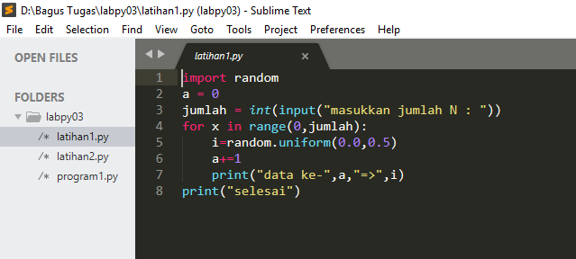
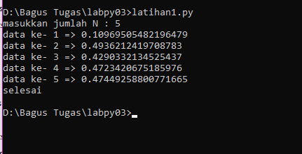
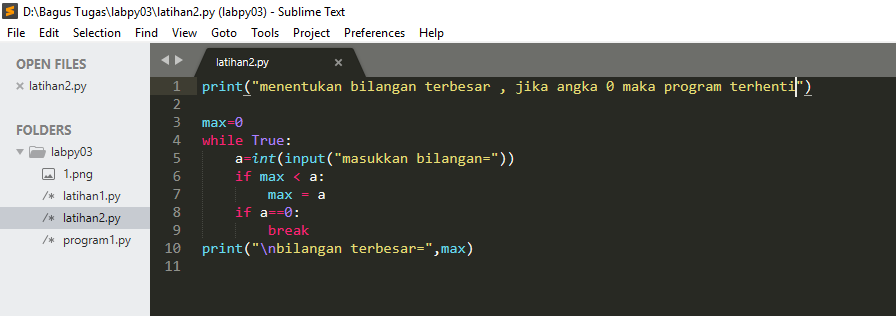
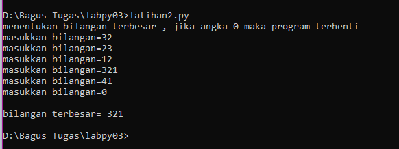
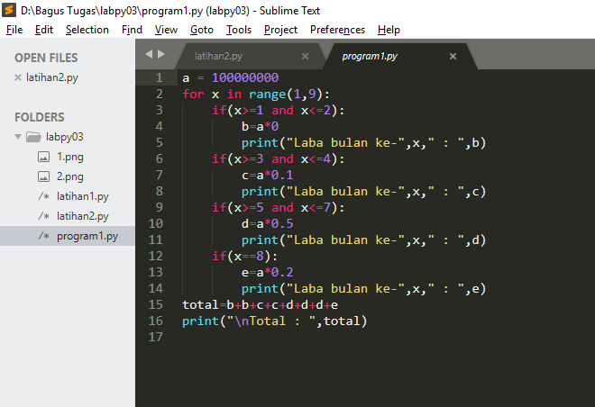
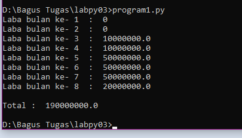

# Alur algoritma dan program

>Latihan1 : Menampilkan bilangan secara acak

penjelasanya:

-Import random digunakan untuk memasukkan modul random ke dalam program latihan 1

-Di line ke 3 kita diminta menginputkan bilangan untuk mengisi nilai N (contoh:5)

-Di line ke 5 ada fungsi for digunakan sebagai fungsi perulangan. "For x in range(0,n)", X adalah index dari perulangan tersebut. Range(0,n) artinya dimulai dari 0 sampai N

-Di line ke 6 nilai i akan menampung bilangan secara acak mulai dari 0,0 hingga 0,5

-Di line ke 8 akan menampilkan hasil bilangan yang telah dipilih secara acak pada variabel "i" tadi

>hasil latihan 1

>latihan2 : Bilangan Max

penjelasannya:

-buatlah variabel yang akan digunakan untuk menampung nilai max

-kemudian kita diminta untuk memasukkan nilai

-kemudian perintah while True akan berjalan terus menerus hingga mencapai nilai false

-Jika nilai max awal lebih kecil dari nilai B, maka nilai max akan menjadi nilai B yang sekarang 

-Jika user memasukkan nilai B sama dengan 0, maka program akan terhenti

-Terakhir program akan menampilkan nilai terbesar di antara banyak nya nilai yang di inputkan sebelumnya

>hasil latihan 2

>Program1

Penjelasannya:

-pertama masukkan nilai modal awal ke variable a (contoh 100.000.000)

-Lakukan perulangan mulai dari angka 1 sampai dengan angka 9

-Di line ke 3, jika nilai x lebih dari sama dengan 1 Dan kurang dari sama dengan 2 maka menampilkan hasil dari laba bulan 1 dan 2. nilai B sebagai laba bulan ke1 dan ke 2

-Di line ke 6, jika nilai x lebih dari sama dengan 3 Dan kurang dari sama dengan 4 maka menampilkan hasil dari laba bulan 3 dan 4. nilai C sebagai laba bulan ke3 dan ke 4

-Di line ke 9, jika nilai x lebih dari sama dengan 5 Dan kurang dari sama dengan 7 maka menampilkan hasil dari laba bulan 5 sampai dengan bulan ke 7. nilai D sebagai laba bulan ke 5, ke 6, dan ke 7

-Di line ke 12, jika nilai x sama dengan 8 maka menampilkan hasil laba bulan 8. nilai E sebagai laba bulan ke 8

-kemudian nilai total akan menghitung jumlah seluruh laba dari bulan 1 hinnga 8

-terakhir akan menampilkan total laba

>hasil program 1 : Menghitung laba

